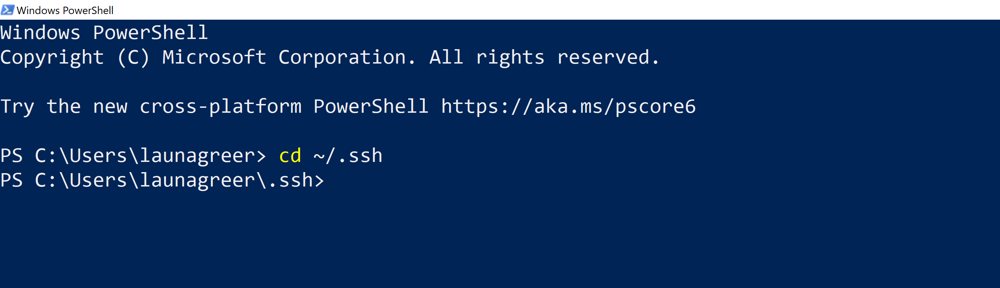
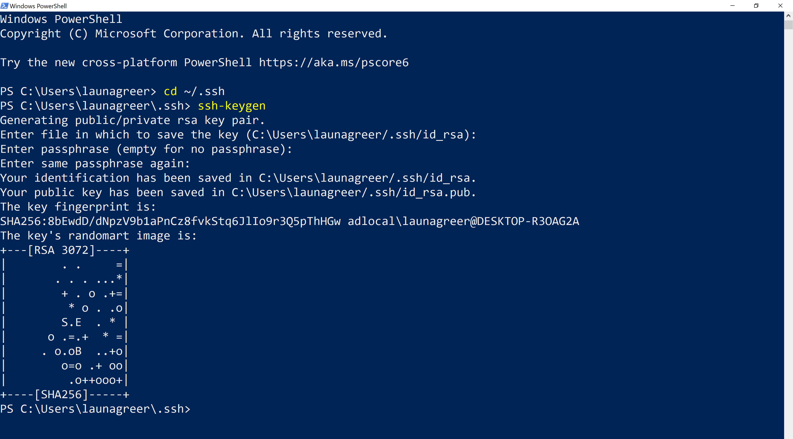
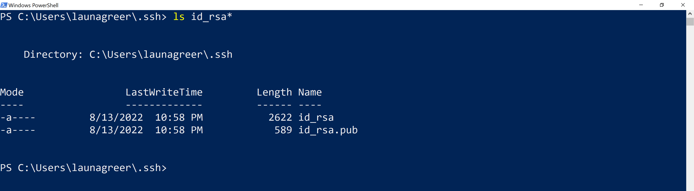
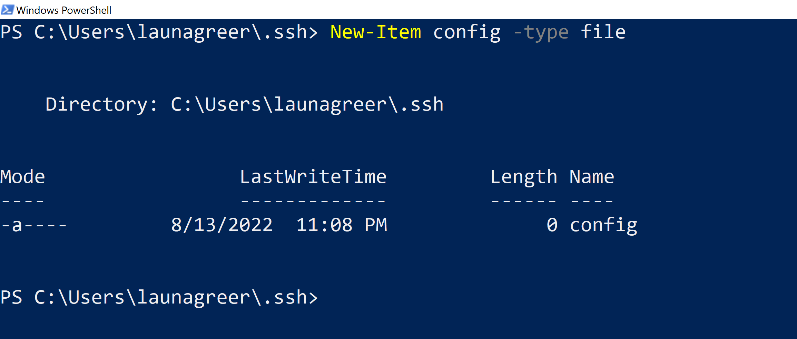
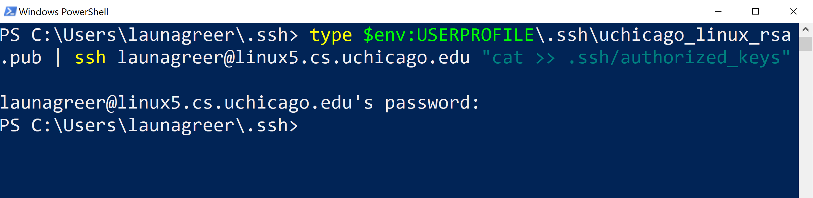
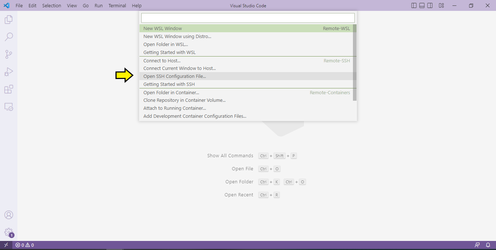
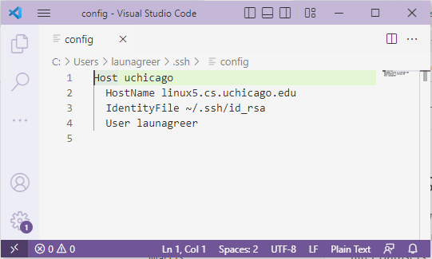
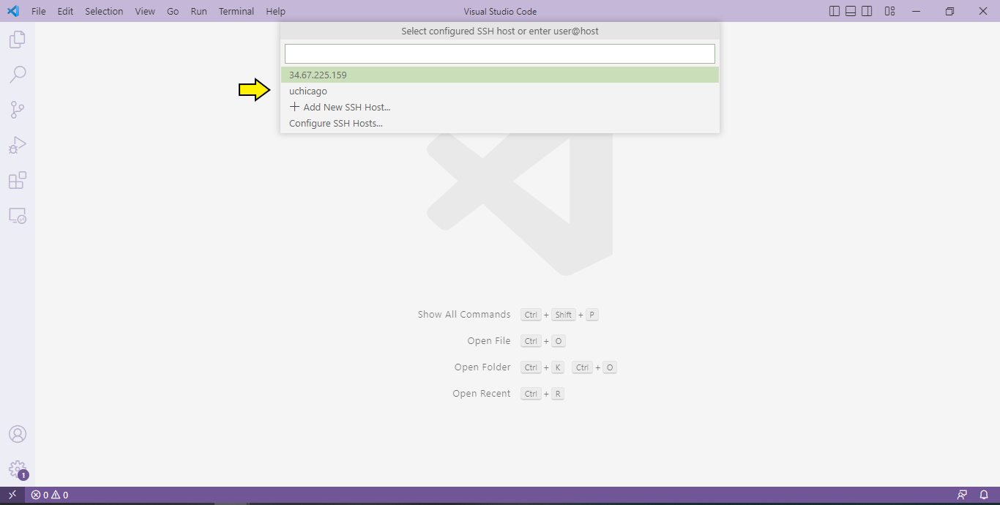

# Connect to the Remote Linux Server

## Install Prerequisite Tools

Before getting started, you should have the following tools installed:

- OpenSSH Client
- Visual Studio Code
- VS Code extensions for Python and Remote-SSH

## Step 1. Generate SSH Private-Public Key Pair and Config File

Open Windows PowerShell or MacOS Terminal and change your current working directory to the ".ssh" folder using `cd .ssh`.



Create a new key pair using the command `ssh-keygen`.



Confirm that two new files, "id_rsa" and "id_rsa.pub", are present by listing the contents of the directory with `ls`. (Note: Because I have other files in the `.ssh` directory unrelated to the camp, I've used a wild card (*)  to only show those that begin with "id_rsa".)



If a file called `config` does not appear in the output, create it using `New-Item config -type file` (Windows) or `touch config` (MacOS and Linux).




## Step 2. Copy Public Key to Assigned Remote Server and Authorize

The main Linux server (linux.cs.uchicago.edu) acts as a front end for specific Linux machines (named linux1.cs.uchicago.edu through linux7.cs.uchicago.edu). VS Code works best when connected with a specific machine rather than to the front end.

To avoid having everyone use the same server (e.g., linux1.cs.uchicago.edu) and concentrate too much traffic in one network location, we have assigned you a server to use based on the first letter of your CNetID (i.e., the part of your UChicago email address that comes before the @ sign). For example, my CNetID is `launagreer`, so I would be assigned to linux5.cs.uchicago.edu.

|Starts With|Assigned To|
|---|---|
|A, B|linux1.cs.uchicago.edu|
|C, D, E|linux2.cs.uchicago.edu|
|F, G, H, I, K|linux3.cs.uchicago.edu| 
|J|linux4.cs.uchicago.edu|
|L, M, N, O|linux5.cs.uchicago.edu|
|P, Q, R, X, Y, Z|linux6.cs.uchicago.edu|
|S, T, U, V, W|linux7.cs.uchicago.edu|

Note your assigned server. Then run the following command in your open terminal and enter your UChicago password when prompted.

_Windows_

```powershell
type $env:USERPROFILE\.ssh\id_rsa.pub | ssh <cnetId>@<linuxServer> "cat >> .ssh/authorized_keys”
```



_MacOS_

```bash
ssh-copy-id -i ~/.ssh/id_rsa <cnetId>@<linuxServer>
```

## Step 3. Configure Remote SSH Connection in VS Code

Open VS Code and click the button with angled braces (><) in the very bottom left-hand corner of the window.

Select "Remote-SSH: Open Configuration File" and then the config file created in the previous step.  Add an entry resembling the following below, replacing <linuxServer> and <cnetId> with the appropriate values. Then save your changes.

```
Host uchicago
  HostName <linuxServerName>
  IdentityFile ~/.ssh/id_rsa
  User <cnetId>
```





## Step 4. Log into the Remote Server.

Click the bottom lefthand button again, but this time, select "Remote-SSH: Connect to Host". Choose "uchicago" and then wait for the VS Code server to connect to the remote Linux server.

If the connection succeeds, the button should display the text: "SSH: uchicago".



